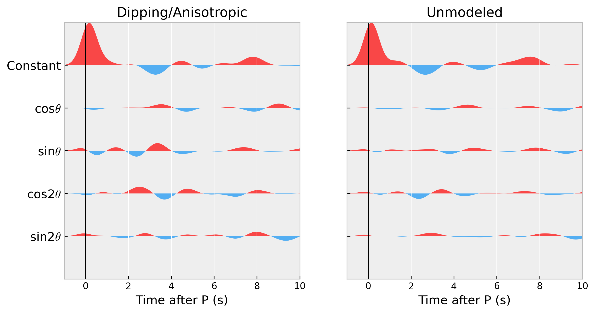

# Harmonic decomposition

## Background
Harmonic decomposition is an effective technique to separate anisotropic and dipping components from radius and transverse RFs ([Bianchi et al., 2010](https://doi.org/10.1029/2009JB007061])). This technique not only used to estimate azimuthal crustal anisotropy and crustal layer dipping , but used to extract isotropic component of RF for 1D RF inversion. In the Seispy, the command `rfharmo` is accessible for computing the harmonic decomposition, plotting different components after the decomposition, and save the isotropic component to a local SAC file.

```
usage: Harmonic decomposition for extracting anisotropic and isotropic features from the radial and transverse RFs [-h] [-t tb/te] [-s dt] [-o outpath] [-e enf] [-p figure_path] rfpath

positional arguments:
  rfpath          Path to PRFs

optional arguments:
  -h, --help      show this help message and exit
  -t tb/te        Time window from tb to te for trimming RFs, NOTE: do not insert space before this argument, defaults to -2/10
  -s dt           Resample RFs with sampling interval of dt
  -o outpath      Specify output path for saving constant component.
  -e enf          Enlarge factor, defaults to 2
  -p figure_path  Figure output path, defaults to ./
```

## Download this example
Users can download the same file as [`ex-rfani.tar.gz`](https://osf.io/download/4hk6d/):

- Unzip the file to any directory.

    ```shell
    wget https://osf.io/download/4hk6d/ -O ex-rfani.tar.gz
    tar -xzf ex-rfani.tar.gz
    ```

## Run this example

Change directory to `ex-rfani` and just run following in the command line

```
rfharmo -o./
```

- The RFs are trimmed from -2s to 10s as default.
- Append `-o./` to specify the output path to save the isotropic component as SAC format (`SC.LTA_constant_R.sac`).
- The result of `SC.LTA_harmonic_trans.png` is automatically saved to current directory as default.


:::{figure-md} fig-target 



Result of harmonic decomposition in SC.LTA
:::