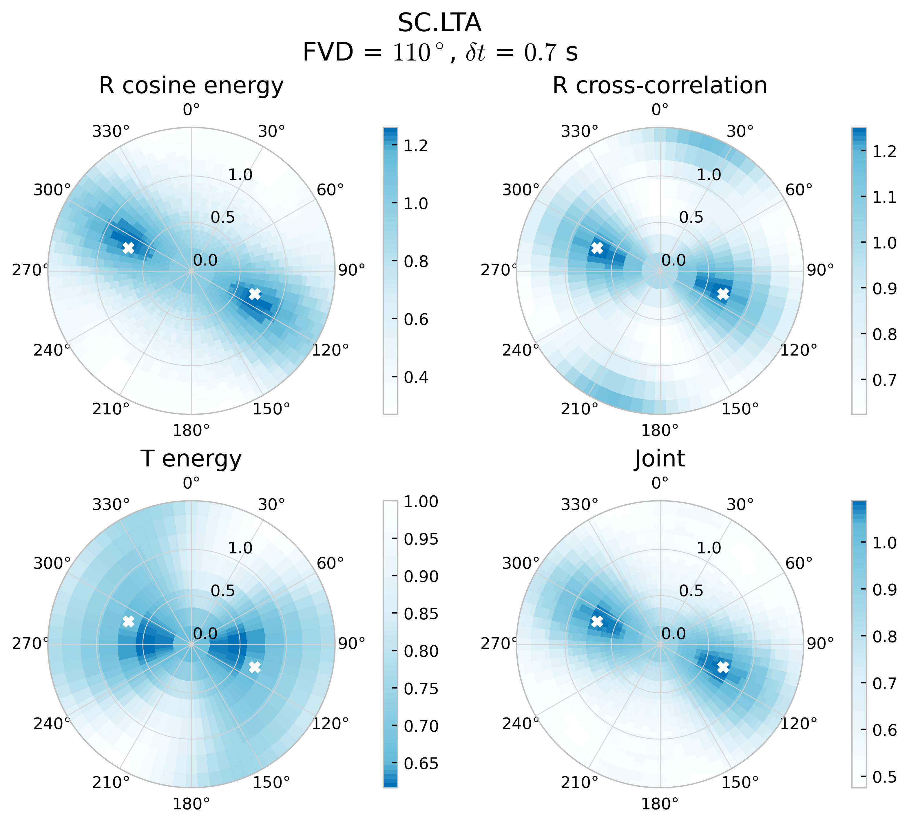
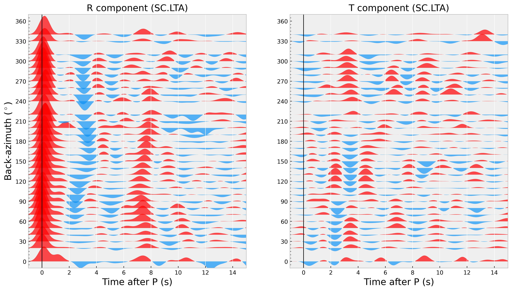

# Crustal anisotropic estimation with a single station

## Background
[Liu and Niu (2011)](https://doi.org/10.1111/j.1365-246X.2011.05249.x) has provided a method to joint estimating crustal seismic anisotropy with radial energy maximization, radial correlation coefficient (cc) maximization and transverse energy minimization. Users can run `rfani` after PRFs of single station calculated for estimating crustal anisotropy. 

```
usage: rfani [-h] -t tb/te [-c list_file_name] [-l half_time_length] [-r rayp] [-m velocity_model] [-o OUTPATH] [-p] [-w w1/w2/w3] rfpath

Estimate crustal anisotropy with a Joint inversion method. See Liu and Niu (2012) in detail.

positional arguments:
  rfpath               Path to PRFs

optional arguments:
  -h, --help           show this help message and exit
  -t tb/te             Time window for searching Pms from tb to te
  -c list_file_name    List file in text format for saving results, defaults to ./rfani.dat
  -l half_time_length  Half length of time window cut around Pms phase, defaults to 3s
  -r rayp              Ray-parameter for moveout correction, defaults to 0.06 s/km
  -m velocity_model    velocity model for moveout correction. 'iasp91', 'prem'and 'ak135' is valid for internal model. Specify path to velocity model for the customized model.The format is the same as in Taup, but the depth
                       should be monotonically increasing, defaults to 'iasp91'
  -o OUTPATH           Directory to the image, defaults to current directory.
  -p                   If plot RFs stacked by back-azimuth, defaults to 'False'
  -w w1/w2/w3          Weights of 3 anisotropic methods (order by R cosine energy, R cross-correlation and T energy), defaults to 0.4/0.4/0.2
```

## Download this example 

- Download link: [ex-rfani.tar.gz](https://osf.io/download/4hk6d/)
- Unzip the file to any directory.

    ```shell
    wget https://osf.io/download/4hk6d/ -O ex-rfani.tar.gz
    tar -xzf ex-rfani.tar.gz
    ```

This package involves PRFs of the station SC.LTA after visual checking.

## Run this example

Change directory to `ex-rfani` and just run following in the command line

```
rfani -t 6/10 -l 3.5 SC.LTA -p
```

- In this example, the Pms phases is visible between 6 ~ 10s.
- The time length is cut from +/- 3.5s around the Pms phase. 
- Append `-p` to output a figure, which shows radial and transverse PRFs binned stacked by back-azimuth.
- As default the value of fast velocity directory and delay time are append to file `./rfani.dat`

:::{figure-md} fig-target 



Result of crustal anisotropy
:::


:::{figure-md} fig-target 



Binned stacked PRFs order by back-azimuth
:::