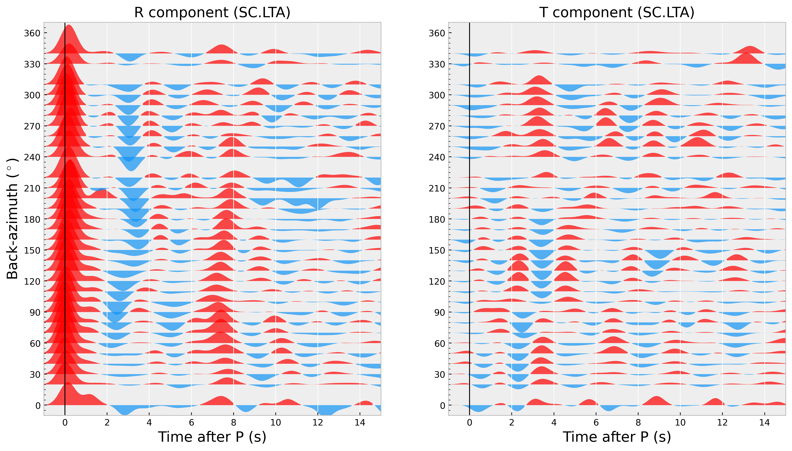

# Examples

:::{card} RF calculation & H-k stacking
:link: ex-prf
:link-type: doc

<div class="center">


</div>
:::

:::{card} CCP stacking along a profile
:link: ex-ccp
:link-type: doc

```{image} ../_static/profile_ZX.png
:width: 500px
:align: center
```
:::

:::{card} 3D CCP stacking & extracting D410 and D660 depth
:link: ex-ccp3d
:link-type: doc

<div class="center">


</div>
:::

:::{card} Crustal anisotropic estimation with a single station
:link: ex-rfani
:link-type: doc

<div class="center">


</div>
:::

:::{card} Harmonic decomposition
:link: ex-harmo
:link-type: doc
```{image} ../_static/SC.LTA_harmonic_trans.png
:width: 500px
:align: center
```
:::


```{toctree}
:maxdepth: 2

ex-prf
ex-ccp
ex-ccp3d
ex-rfani
ex-harmo
```